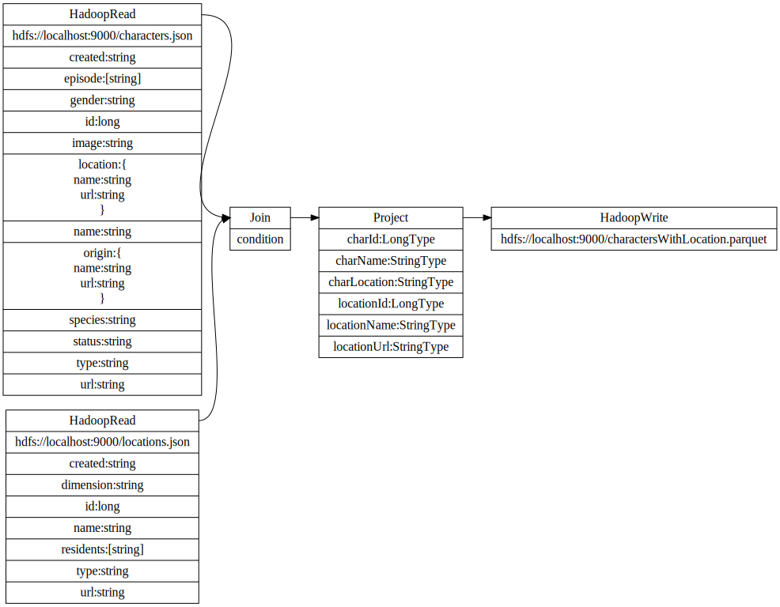

# Spark Lineage

This library generates the lineage information based on the run time queries executed by Spark. The lineage is formatted as json and is persisted as a log entry. 
The advantages of a logging framework are
* separation between the _generation_ of the lineage vs the _processing_ of the lineage (visualization, governance..) 
* no dependency on a file system, external database.. to store the lineage information.

It is possible to capture the logs in the Spark driver. The integrated test contains an example of an InMemoryAppender to keep the logs in memory.

## Use the LineageListener

The only modifications you need to an existing Spark application are
1. the registration of the lineage listener
2. the configuration of the logging properties.

Register an instance of the DataLineageQueryExecutionListener before the Spark engine is started. When Spark executes a Spark [action](https://spark.apache.org/docs/latest/rdd-programming-guide.html), the logical plan is analyzed, transformed to json and finally logged. 

```scala
// register the the DataLineage listener 
spark.listenerManager.register(
  new DataLineageQueryExecutionListener()
)
```

The lineage is logged at the INFO level, so you need to set the level to at least INFO. 

```properties
log4j.logger.io.nomad48=INFO, <your appender>
```

## Example Spark Lineage

### Spark Application

Once the 2 modifications are coded, the Spark application is executed as before. The application can use the Spark API and/or the Spark SQL API. Any Spark transformation which contains an action will generate the lineage information in the logs. 

In the following example, 2 json files are read from HDFS. The 2 dataframes are joined and then projected (with column renaming). 

```scala
// read first json file
val characters: DataFrame = getSpark().read
  .format("json")
  .options(Map("multiline" -> "true"))
  .load("/characters.json")
// read second json file
val locations: DataFrame = spark.read
  .format("json")
  .options(Map("multiline" -> "true"))
  .load("/locations.json")
// join the 2 files, project and rename some columns
val df = characters
  .join(locations, characters("location.url") === locations("url"))
  .select(
    characters("id").alias("charId"),
    characters("name").alias("charName"),
    characters("location.url").alias("charLocation"),
    locations("id").as("locationId"),
    locations("name").alias("locationName"),
    locations("url").alias("locationUrl")
  )
// write the result to a file
df.write.format("parquet").save("/charactersWithLocation.parquet")
```

### Lineage Logs

The lineage information is logged as INFO using the `io.nomad48.datective.lineage.DataLineageQueryExecutionListener` class name. Once the logs are retrieved (for example Yarn, Prometheus), they are transformed to a specific purpose. 

```log
...
18:55:09 [INFO ] io.nomad48.datective.lineage.DataLineageQueryExecutionListener:52 - {"user":"Paul De Schacht","appName":"PrepareForUploadTest","appId":"local-1614880502682","appAttemptId":"","duration":2440529300,"lineage":{"op":"hadoopWrite","output":"hdfs://localhost:9000/charactersWithLocation.parquet","format":"Parquet","mode":"ErrorIfExists","child":{"op":"project","fields":[{"name":"charId","type":"LongType"},{"name":"charName","type":"StringType"},{"name":"charLocation","type":"StringType"},{"name":"locationId","type":"LongType"},{"name":"locationName","type":"StringType"},{"name":"locationUrl","type":"StringType"}],"child":{"op":"join","type":"Inner","left":{"op":"relation","class":"class org.apache.spark.sql.execution.datasources.LogicalRelation","streaming":false,"catalog":null,"relation":{"op":"hadoopRead","location":["hdfs://localhost:9000/characters.json"],"format":"json","schema":{"type":"struct","fields":[{"name":"created","type":"string","nullable":true,"metadata":{}},{"name":"episode","type":{"type":"array","elementType":"string","containsNull":true},"nullable":true,"metadata":{}},{"name":"gender","type":"string","nullable":true,"metadata":{}},{"name":"id","type":"long","nullable":true,"metadata":{}},{"name":"image","type":"string","nullable":true,"metadata":{}},{"name":"location","type":{"type":"struct","fields":[{"name":"name","type":"string","nullable":true,"metadata":{}},{"name":"url","type":"string","nullable":true,"metadata":{}}]},"nullable":true,"metadata":{}},{"name":"name","type":"string","nullable":true,"metadata":{}},{"name":"origin","type":{"type":"struct","fields":[{"name":"name","type":"string","nullable":true,"metadata":{}},{"name":"url","type":"string","nullable":true,"metadata":{}}]},"nullable":true,"metadata":{}},{"name":"species","type":"string","nullable":true,"metadata":{}},{"name":"status","type":"string","nullable":true,"metadata":{}},{"name":"type","type":"string","nullable":true,"metadata":{}},{"name":"url","type":"string","nullable":true,"metadata":{}}]},"dataSchema":{"type":"struct","fields":[{"name":"created","type":"string","nullable":true,"metadata":{}},{"name":"episode","type":{"type":"array","elementType":"string","containsNull":true},"nullable":true,"metadata":{}},{"name":"gender","type":"string","nullable":true,"metadata":{}},{"name":"id","type":"long","nullable":true,"metadata":{}},{"name":"image","type":"string","nullable":true,"metadata":{}},{"name":"location","type":{"type":"struct","fields":[{"name":"name","type":"string","nullable":true,"metadata":{}},{"name":"url","type":"string","nullable":true,"metadata":{}}]},"nullable":true,"metadata":{}},{"name":"name","type":"string","nullable":true,"metadata":{}},{"name":"origin","type":{"type":"struct","fields":[{"name":"name","type":"string","nullable":true,"metadata":{}},{"name":"url","type":"string","nullable":true,"metadata":{}}]},"nullable":true,"metadata":{}},{"name":"species","type":"string","nullable":true,"metadata":{}},{"name":"status","type":"string","nullable":true,"metadata":{}},{"name":"type","type":"string","nullable":true,"metadata":{}},{"name":"url","type":"string","nullable":true,"metadata":{}}]},"estimatedSize":20211}},"right":{"op":"relation","class":"class org.apache.spark.sql.execution.datasources.LogicalRelation","streaming":false,"catalog":null,"relation":{"op":"hadoopRead","location":["hdfs://localhost:9000/locations.json"],"format":"json","schema":{"type":"struct","fields":[{"name":"created","type":"string","nullable":true,"metadata":{}},{"name":"dimension","type":"string","nullable":true,"metadata":{}},{"name":"id","type":"long","nullable":true,"metadata":{}},{"name":"name","type":"string","nullable":true,"metadata":{}},{"name":"residents","type":{"type":"array","elementType":"string","containsNull":true},"nullable":true,"metadata":{}},{"name":"type","type":"string","nullable":true,"metadata":{}},{"name":"url","type":"string","nullable":true,"metadata":{}}]},"dataSchema":{"type":"struct","fields":[{"name":"created","type":"string","nullable":true,"metadata":{}},{"name":"dimension","type":"string","nullable":true,"metadata":{}},{"name":"id","type":"long","nullable":true,"metadata":{}},{"name":"name","type":"string","nullable":true,"metadata":{}},{"name":"residents","type":{"type":"array","elementType":"string","containsNull":true},"nullable":true,"metadata":{}},{"name":"type","type":"string","nullable":true,"metadata":{}},{"name":"url","type":"string","nullable":true,"metadata":{}}]},"estimatedSize":23649}},"condition":{"op":"=","type":"BooleanType","sql":"(`location`.`url` = `url`)","left":{"op":"expression","type":"StringType","sql":"`location`.`url`","children":[{"op":"namedExpression","alias":"location","type":"StructType(StructField(name,StringType,true), StructField(url,StringType,true))","sql":"`location`"}]},"right":{"op":"namedExpression","alias":"url","type":"StringType","sql":"`url`"}},"constraints":[{"op":"=","type":"BooleanType","sql":"(`location`.`url` = `url`)","left":{"op":"expression","type":"StringType","sql":"`location`.`url`","children":[{"op":"namedExpression","alias":"location","type":"StructType(StructField(name,StringType,true), StructField(url,StringType,true))","sql":"`location`"}]},"right":{"op":"namedExpression","alias":"url","type":"StringType","sql":"`url`"}},{"op":"expression","type":"BooleanType","sql":"(`location` IS NOT NULL)","children":[{"op":"namedExpression","alias":"location","type":"StructType(StructField(name,StringType,true), StructField(url,StringType,true))","sql":"`location`"}]},{"op":"expression","type":"BooleanType","sql":"(`url` IS NOT NULL)","children":[{"op":"namedExpression","alias":"url","type":"StringType","sql":"`url`"}]}]}}}}
...
```

### Transform the lineage logs to a visualization language.

A simple example the visualization of the lineage. The json is converted to the [DOT](https://graphviz.org/doc/info/lang.html) language for easy display. 




# Development 

## Integrated Test

The test runs an in-memory HDFS and Spark cluster (see below for running this under Windows) and uses a log4j Appender to capture the logs in memory.

The data are samples from [The Rick And Morty API](https://rickandmortyapi.com/)


## Development on Windows

* Copy "winutils.exe" and "hadoop.dll" from [winutils](https://github.com/steveloughran/winutils/tree/master/hadoop-2.7.1/bin) in a folder, for example d:\hadoop\bin. 
* Set the user variable %HADOOP_HOME% to d:\hadoop and add d:\hadoop\bin to the system variable %PATH%.
* Use a temporary folder without spaces in the EmbeddedHdfsSpark.startHdfs. If the folder does not exist, it will be created

```code
 startHdfs(new File("c:\\tmp"))
```
* It is recommended to use either an absolute destination folder in EmbeddedHdfsSpark.copyFromLocal(source, destination). Otherwise, the Windows implementation uses the local user name and if that name contains spaces, it seems to go wrong. 

## Use Java 8 

For version Spark 2.3.x --> limited to Java 8

## Roadmap

* integration / link with [OpenLineage](https://github.com/OpenLineage/OpenLineage)
* document the lineage JSON data structure
* cross link with newer Spark versions
  ```text
  Spark 2.3.2 requires Scala 2.11 (https://spark.apache.org/docs/2.3.2/)
  Scala 2.11 runs best on JDK8 (https://docs.scala-lang.org/overviews/jdk-compatibility/overview.html)
  
  for Windows: set JAVA_HOMES to the folder containing multiple Java versions and define the required version in the file .java-version
  https://stackoverflow.com/questions/56418191/how-to-set-up-sbt-on-windows-to-select-a-specific-jdk-among-available-jdks
  ```
* improve the DataFlow functionality

